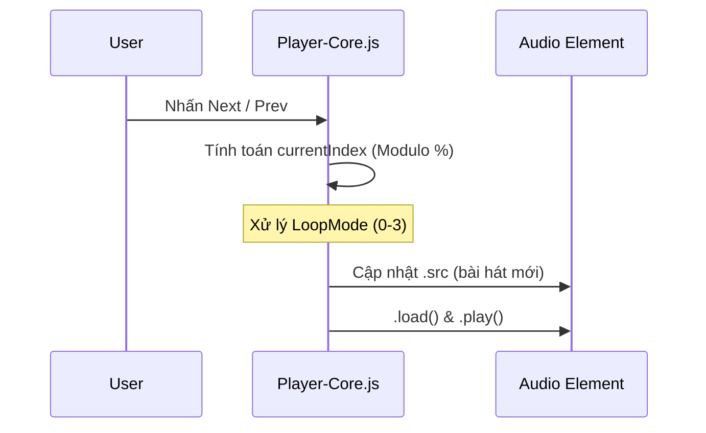

# 📘 Tài Liệu Thiết Kế Hệ Thống - Music App (V2.1 - Updated)

## 1. Tổng Quan Kỹ Thuật (Tech Stack)

* **Backend:** Java 21 (LTS), Spring Boot 4.0.6.
* **Database:** MongoDB (NoSQL) - Lưu trữ linh hoạt, hỗ trợ lời nhạc đa ngôn ngữ.
* **Frontend:**
* **JSP + JSTL:** Template engine tạo giao diện server-side.
* **HTMX:** Xử lý render động, giúp chuyển hướng trang không bị load lại (Single-Page feel).
* **Bootstrap 5:** Giao diện Responsive & Dark Mode.

* **Định dạng lời nhạc:** `.lrc` (Parsed & Map-stored).

---

## 2. Mô Hình Dữ Liệu & Logic Trình Phát

### 2.1. Logic State Machine cho Player (Player-Core)

Để đảm bảo tính nhất quán của trình phát nhạc, hệ thống sử dụng một biến `loopMode` và danh sách `queue` làm nguồn sự thật duy nhất (Single Source of Truth).

| Trạng thái (`loopMode`) | Ý nghĩa | Hành vi `nextSong()` |
| --- | --- | --- |
| `0` | Bình thường | Tăng index, dừng ở cuối queue. |
| `1` | Lặp 1 bài | Reset `currentTime = 0`, `play()` lại. |
| `2` | Lặp tất cả | Quay vòng về index 0 sau bài cuối. |
| `3` | Xáo trộn | Chọn index ngẫu nhiên (dùng Fisher-Yates). |

---

## 3. Quy trình xử lý lỗi Giao diện (HTMX Integration)

Để tránh lỗi **"Bảng lồng bảng"** và lặp lại Header/Navbar, tài liệu quy chuẩn lại cấu trúc View:

1. **Khung cố định (Layout):** `index.jsp` chứa `Navbar`, `Footer`, và `<table>` (khung `<thead>`).
2. **Khu vực thay đổi (Target):** `<tbody>` với `id="songListBody"`.
3. **Luồng HTMX:** Khi người dùng click menu, HTMX chỉ fetch file JSP chứa các dòng `<tr>` và chèn vào `songListBody`.
* **Quy chuẩn:** Controller phải trả về view chỉ chứa `<c:forEach>` các hàng dữ liệu, tuyệt đối không trả về `<html>` hoặc `navbar`.

---

## 4. Các Luồng Nghiệp Vụ Chính (Sequence Diagrams)

### 4.1. Luồng Next/Prev (Vòng lặp danh sách)

Sử dụng toán tử Modulo (`%`) để đảm bảo tính tuần hoàn.

---

## 5. Đặc Tả Implementation (Backend & Frontend)

### 5.1. Xử lý Lời nhạc (.lrc)

* **Regex:** `\[(\d{2}):(\d{2})\.(\d{2,3})\](.*)`
* **Lưu trữ:** Mỗi bài hát có một `lyricsMap` (key: mã ngôn ngữ, value: list các object `{time, content}`).

### 5.2. Tối ưu hóa Java 21

* **Virtual Threads:** Cấu hình `spring.threads.virtual.enabled=true` để tăng khả năng xử lý đồng thời cho các tác vụ I/O khi người dùng tải bài hát lên hoặc truy vấn dữ liệu từ MongoDB.

---

## 6. Danh mục Checklist Kiểm thử (QA Checklist)

* [x] **Next/Prev:** Bài cuối bấm Next phải về đầu, bài đầu bấm Prev phải về cuối.
* [x] **Loop Mode 1:** Khi hết nhạc phải tự phát lại chính bài đó, không chuyển bài.
* [x] **HTMX Integration:** Kiểm tra tab Network, đảm bảo kết quả trả về là `fragment` (không chứa header thừa).
* [x] **Shuffle:** Thuật toán Fisher-Yates xáo trộn mảng `queue` gốc.
* [x] **Performance:** Đảm bảo `Debounce` trên thanh tìm kiếm để tránh gọi DB liên tục.

---

## 7. Quy chuẩn Code (Coding Standard)

* **API:** Trả về JSON chuẩn qua `ResponseEntity<ResponseDTO>`.
* **Frontend:** Không trùng lặp định nghĩa hàm giữa `player-core.js` và `player-controls.js`. Ưu tiên tập trung mọi logic `next/prev/play` vào `player-core.js`.
* **Database:** Ưu tiên `isDeleted` flag cho xóa mềm thay vì xóa cứng dữ liệu.

---
