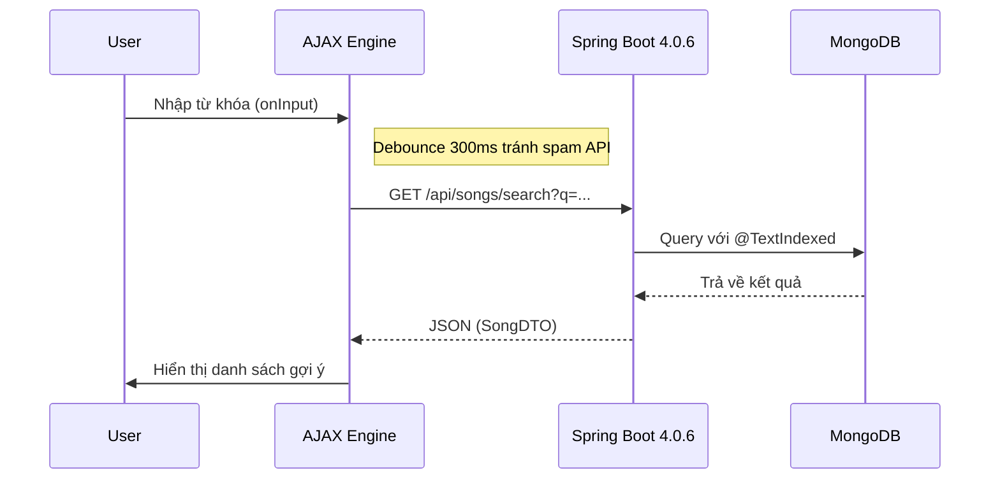
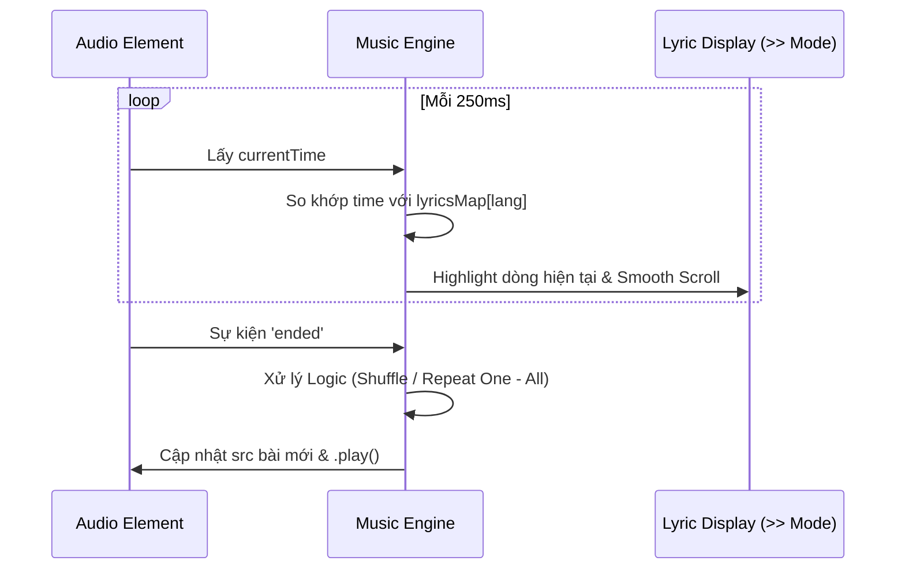

# 📘 Tài Liệu Thiết Kế Hệ Thống - Music App (V2.0)

## 1. Tổng Quan Kỹ Thuật (Tech Stack)

* **Backend:** Java 21 (LTS), Spring Boot 4.0.6.
* **Database:** MongoDB (NoSQL).
* **Kiến trúc:** Micro-monolith (hướng dịch vụ), AJAX-driven UI (không load lại trang để giữ nhạc).
* **Định dạng lời nhạc:** Standard `.lrc` (Lyric Runtime Control).

---

## 2. Mô Hình Dữ Liệu (Data Model)

Thiết kế tập trung vào tính linh hoạt của MongoDB để xử lý lời nhạc đa ngôn ngữ.

### 2.1. User Entity

Quản lý định danh và trạng thái tài khoản.

* `id`: String (ObjectId).
* `username`: String (Unique Index).
* `role`: Enum (ADMIN, USER).
* `isEnabled`: Boolean (Dùng cho chức năng khóa/mở tài khoản của Admin).

### 2.2. Song Entity (Multi-language Support)

Điểm mấu chốt là `lyricsMap` cho phép một bài hát có nhiều bản dịch.

```java
@Document(collection = "songs")
public class Song {
    @Id
    private String id;
    @TextIndexed
    private String title;  // Đánh chỉ mục Text để search gợi ý
    private String artist;
    private String audioUrl;
    private String uploaderId;
    
    // Key: "vi", "en", "jp"... 
    // Value: List các dòng lời tương ứng
    private Map<String, List<LyricLine>> lyricsMap; 
}

public class LyricLine {
    private double time;     // Thời điểm bắt đầu câu hát (giây)
    private String content;  // Nội dung câu hát
}

```

---

## 3. Các Luồng Nghiệp Vụ Chính (Sequence Diagrams)

### 3.1. Tìm kiếm không ngắt nhạc (AJAX Search)

Đảm bảo khi tìm kiếm, Player ở phía dưới không bị Reset.



### 3.2. Đồng bộ lời nhạc & Chuyển bài (Lyric Sync)

Cơ chế xử lý lời nhạc thời gian thực tại Client.



---

## 4. Đặc Tả Use Cases Cho Lập Trình Viên

### UC-01: Quản lý cá nhân (Self-Service)

* **Mô tả:** Người dùng quản lý Album, Playlist và thông tin cá nhân.
* **Lưu ý kỹ thuật:** Luôn kiểm tra `ownerId` tại tầng Service. Chỉ cho phép chỉnh sửa nếu `currentUser.id == resource.ownerId`.

### UC-02: Chế độ Xem lời (Lyric View Mode)

* **Giao diện:** Khi bấm nút `>>`, nội dung chính ẩn đi, màn hình lời toàn cảnh hiện lên.
* **Logic:** Chuyển đổi trạng thái bằng CSS Class thay vì load lại trang để bảo toàn luồng Audio.

### UC-03: Quản trị Admin

* **Mô tả:** Khóa người dùng, xóa bài hát vi phạm.
* **Bảo mật:** Sử dụng `@PreAuthorize("hasRole('ADMIN')")` tại Controller.

---

## 5. Hướng dẫn Triển Khai (Implementation Guide)

### 1. Xử lý File .lrc

Khi người dùng upload file `.lrc`, sử dụng Regex trong Java để parse.

* **Regex mẫu:** `\[(\d{2}):(\d{2})\.(\d{2,3})\](.*)`
* **Chuyển đổi:** `(phút * 60) + giây + (mili / 1000)` -> Lưu vào trường `time` (double).

### 2. Tối ưu Java 21

* Sử dụng **Virtual Threads** cho các tác vụ I/O nặng (như upload file lên Cloudinary) bằng cách cấu hình:
`spring.threads.virtual.enabled=true`.

### 3. Phân vùng UI

* **Fixed Player:** Luôn nằm ở Bottom.
* **Dynamic Content:** Nằm ở giữa, load qua AJAX.
* **Sidebar Queue:** Hiển thị danh sách bài tiếp theo khi click icon mở rộng.

---

## 6. Quy chuẩn Code (Coding Standard)

* **API:** Trả về định dạng JSON thống nhất qua `ResponseEntity<ResponseDTO>`.
* **Database:** Hạn chế xóa cứng (Hard Delete), ưu tiên dùng flag `isDeleted` hoặc `isEnabled`.
* **Frontend:** Sử dụng Vanilla JS hoặc các Lightweight Framework để đảm bảo tốc độ phản hồi.


